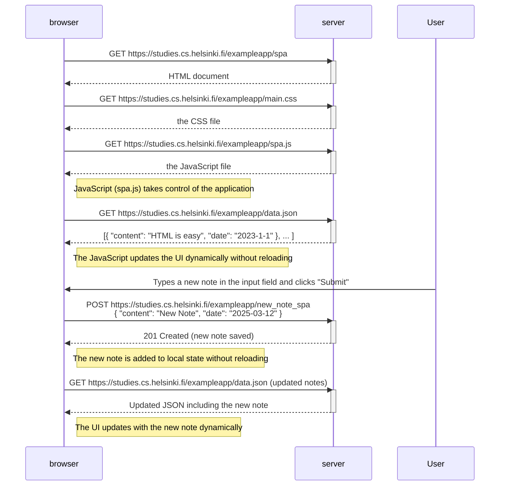

```mermaid
sequenceDiagram
    participant browser
    participant server

    browser->>server: GET https://studies.cs.helsinki.fi/exampleapp/spa
    activate server
    server-->>browser: HTML document
    deactivate server

    browser->>server: GET https://studies.cs.helsinki.fi/exampleapp/main.css
    activate server
    server-->>browser: the CSS file
    deactivate server

    browser->>server: GET https://studies.cs.helsinki.fi/exampleapp/spa.js
    activate server
    server-->>browser: the JavaScript file
    deactivate server

    Note right of browser: JavaScript (spa.js) takes control of the application

    browser->>server: GET https://studies.cs.helsinki.fi/exampleapp/data.json
    activate server
    server-->>browser: [{ "content": "HTML is easy", "date": "2023-1-1" }, ... ]
    deactivate server

    Note right of browser: The JavaScript updates the UI dynamically without reloading

    User->>browser: Types a new note in the input field and clicks "Submit"

    browser->>server: POST https://studies.cs.helsinki.fi/exampleapp/new_note_spa <br> { "content": "New Note", "date": "2025-03-12" }
    activate server
    server-->>browser: 201 Created (new note saved)
    deactivate server

    Note right of browser: The new note is added to local state without reloading

    browser->>server: GET https://studies.cs.helsinki.fi/exampleapp/data.json (updated notes)
    activate server
    server-->>browser: Updated JSON including the new note
    deactivate server

    Note right of browser: The UI updates with the new note dynamically

```